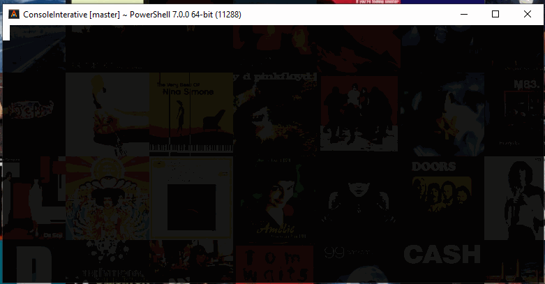

# Forms
---

## About

Sometimes we need build a object from multiple interactions with the user,
to make it easier `Forms` is the solution, by adding the attribute `FormEntry`
to the properties required to retrieve, it's easy to build an object.

---
## Example

##### Class with attributes and validations

```C#
public class TestFormClass {
    public const string REQUIRED = "TEXT_REQUIRED";
    public const string AGE_INTERVAL = "AGE_INTERVAL";
    public const string WORK_TITLES_COMPONENT = "WORK_TITLES_ENUM_COMPONENT";

    public TestFormClass() {
        /* For demo purposes validators and components are register at the constructor 
           In real world, would be better to do it at start up, or before the
           first call */

        // Validation for string
        ValidatorProvider.Global.Register(REQUIRED, ValidatorCollection
            .Create<string>().Add(s => (s.Length > 0, "Can't be empty")));
        
        // Validation for uint
        ValidatorProvider.Global.Register(AGE_INTERVAL, ValidatorCollection
            .Create<uint>()
                .Add(n => (n >= 13, "Age must be older than 13"))
                .Add(n => (n <= 150, "Age must be younger then 150"))
        );

        // Register a custom component with name <WORK_TITLES_COMPONENT>
        ComponentsProvider.Global.Register(WORK_TITLES_COMPONENT, 
            InputSelection.FromEnum<WorkTitles>());
    }

    [FormEntry(Priority = 0, Message = "Insert name", ValidatorsKey = REQUIRED)]
    public string Name { get; set; }

    [FormEntry(Priority = 1, Message = "Insert age", ValidatorsKey = AGE_INTERVAL)]
    public uint Age { get; set; }

    [FormEntry(Priority = 2, Message = "Select work", ProviderKey = WORK_TITLES_COMPONENT)]
    public WorkTitles WorkTitle { get; set; } // Enum

    public override string ToString() {
        return $"{Name} ({Age}) => {string.Join(';', WorkTitle.ToString())}";
    }
}
```

##### Calling input for class

```C#
TestFormClass data = await ConsoleForm.BuildForm<TestFormClass>().Request();
```