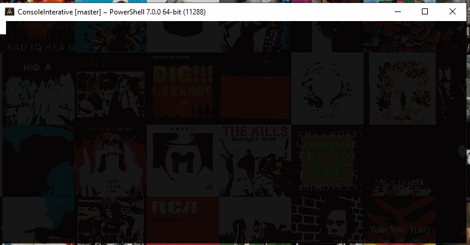

# Input Select Component
---

## About

Component that allow user to select from a list of values

---
## Examples

### Select one from a list
```C#
 var selection = InputSelection.From<TestClass>()
    .AddOption(new TestClass { Name = "option1" })
    .AddOption(new TestClass { Name = "option2" })
    .AddOption(new TestClass { Name = "option3" })
    .AddOption(new TestClass { Name = "option4" });

TestClass result1 = await selection.RequestInput().First();
```

### Multi select
```C#
var selection2 = InputSelection.From<TestClass>()
    .SetMaxSelected(5)
    .AddOption(new TestClass { Name = "option1" })
    .AddOption(new TestClass { Name = "option2" })
    .AddOption(new TestClass { Name = "option3" })
    .AddOption(new TestClass { Name = "option4" })
    .AddOption(new TestClass { Name = "option5" })
    .AddOption(new TestClass { Name = "option6" })
    .AddOption(new TestClass { Name = "option7" })
    .AddOption(new TestClass { Name = "option8" })
    .AddOption(new TestClass { Name = "option9" })
    .AddOption(new TestClass { Name = "option10" })
    .AddOption(new TestClass { Name = "option11" });

IEnumerable<TestClass> result2 = await selection2.RequestInput();
```

### Using an Enum
```C#
EnumTest result3 = await InputSelection
    .FromEnum<EnumTest>()
    .RequestInput()
    .First();
```