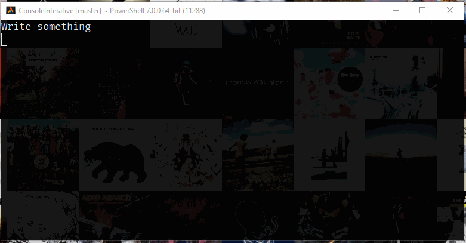

# Input Text Component
---

## About

Component that receives free text input and converts it to a specific type.

---
## Examples

```C#
// Simple string to string input
var inputText = InputText.Create<string>("Write something");
var strQ = await inputText.RequestInput();

// Expects a number input, defaults to 10 if empty
var inputNum = InputText.Create("Write a number", 10L);
long numQ = await inputNum.RequestInput();

// Expects a number between 10 and 50
var validatorMinMax = ValidatorCollection.Create<int>()
    .Add(l => (l > 10, "Value must be higher than 10"))
    .Add(l => (l < 50, "Value must be less than 50"));
var inputInt = InputText.Create("Write a number between 10 and 50", 0, validatorMinMax);
var intQ = await inputInt.RequestInput();
```