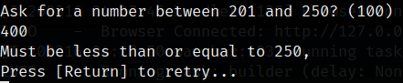
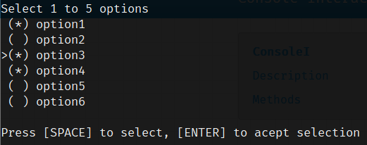
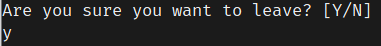
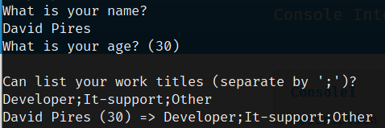

# ConsoleI

## Description

ConsoleI is the principal object for all input request
___
# Methods
___
## AskQuestion
*Question with free text input*



__Signature:__
```C#
Task<T> AskQuestion<T>(string questionMessage, T defaultValue, IQuestionValidators<T> validators )
```
__Details:__

 - Allow to request input using free text, A default value can be passed.
 - It's possible to pass a collection of validators, that will force the user to input a expected value

 - To load all the default question providers you should run: 
`QuestionFactoryProvider.RegisterDefaultProviders();`

 - It's also possible to register custom providers by using:
`QuestionFactoryProvider.RegisterQuestionFormat<T>(BaseQuestion<T> question)`

__Read more at:__

 - [BaseQuestion](/question/base-question/)
 - [QuestionFactory](/question/question-factory/)
 - [QuestionFactoryProvider](/question/question-factory-provider/)
___
## Select
*Force use to select from a predefined list*



__Signature:__
```C#
IEnumerable<T> Select<T>(SelectionGroup<T> group, int max);
T Select<T>() where T : Enum
```

__Details:__

 - User can select 1 to multiple options
 - Works if `Enum` by default
 - If the list is too big will scroll values
 - Allow to use any Type by using `SelectionOption<T>`

__Read more at:__

 - [SelectionOption](selection/selection-option.md)
 - [SelectionGroup](selection/selection-group.md)
___
## AskConfirmation
*User can only select Yes or No*



__Signature:__
```C#
bool AskConfirmation(string message, ConsoleKey okKey = ConsoleKey.Y, ConsoleKey koKey = ConsoleKey.N)
```

__Details:__

 - Only accepts 2 specific keys
 - returns bool
___
## AwaitContinue
*Pauses until user press [RETURN]*


__Signature:__
```C#
void AwaitContinue(string? message = default)
```
___
## RequestForm
*Create object from a list of questions*

__Using:__
```C#
using ConsoleInteractive.Forms;

public class UserCV {
    [FormField("What is your name")]
    public string Name { get; set; }
    [FormField("What is your age", 30)]
    public int Age { get; set; }
    [FormField("Can list your work titles (separate by ';')")]
    public List<string> WorkTitles { get; set; }

    public override string ToString() {
        return $"{Name} ({Age}) => {string.Join(';', WorkTitles)}";
    }
}

var result = await ConsoleI.RequestForm<UserCV>();
Console.WriteLine(result); // UserCV object
```


__Signature:__
```C#
Task<T> RequestForm<T>() where T : class, new()
```
