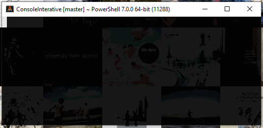
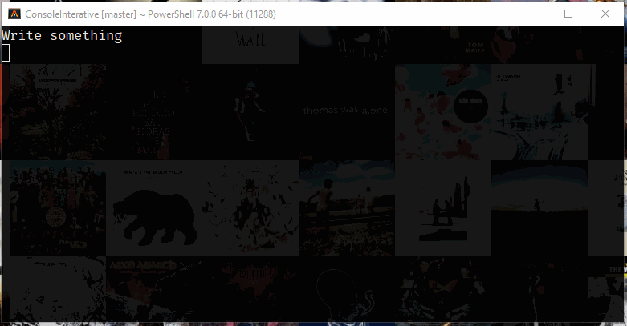
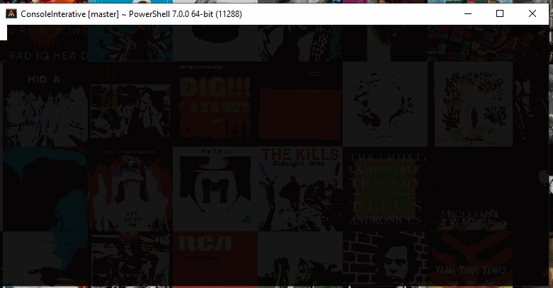

# ConsoleI

## Description

ConsoleI is the principal object for all input request
___
# Methods
___
## AskConfirmation
*User must press key to accept of reject*



__Signature:__
```C#
bool AskConfirmation(string message, ConsoleKey okKey = ConsoleKey.Y, ConsoleKey koKey = ConsoleKey.N)
```

__Params:__

 - *message* -> message to show as question
 - *okKey*   -> `ConsoleKey` to use as `true`
 - *koKey*   -> `ConsoleKey` to use as `false`

__Details:__

 - User must press one of two keys to continue, one returns `true`, other `false`
 - By default keys are `Y` -> true, `N` -> false

---

## Ask
*Receives text input from console and converts to type*



__Signature:__
```C#
Task<T> Ask<T>(string message, T defaultValue = default, IValidatorCollection<T>? validators = null, StringConverterProvider? provider = null)
```

__Params:__

 - *message*      -> message to show before request input
 - *defaultValue* -> value to use as default if no input
 - *validators*   -> input [validators](/adv/validation/)
 - *provider*   -> input [converter provider](/adv/converter/)

__Details:__

 - Allow to request input using free text, A default value can be passed.
 - You can pass a collection of validators, that will force the user to input a expected value
 - You can pass a custom converter provider to convert result

__Read more at:__

 - [InputText](/comps/input-text/)
 - [Validators](/adv/validation/)
 - [Converters](/adv/converter/)
___

## Select
*User must select from a list of values*



__Signature:__
```C#
// select one
Task<T> Select<T>(IEnumerable<T> options);
// select one or more
Task<IEnumerable<T>> Select<T>(IEnumerable<T> options, int max);
// select one from enum type
Task<T> Select<T>() where T : Enum;
// select one or more from enum type
Task<IEnumerable<T>> Select<T>(int max) where T : Enum;
```

__Params:__

 - *options* -> collection of options to show
 - *max* -> max number of selected options allowed

__Details:__

 - User must always select at least one option
 - You can pass a collection of validators, that will force the user to input a expected value
 - You can pass a custom converter provider to convert result

__Read more at:__

 - [InputSelect](/comps/input-sel/)
 - [Validators](/adv/validation/)
 - [Converters](/adv/converter/)
___

## Form
*Build object from multi questions, using `FormEntry` attribute*


__Signature:__
```C#
Task<T> RenderForm<T>() where T : new()
```

__Details:__

 - T must have properties with attribute `FormEntry`

__Read more at:__

 - [Form](/adv/forms/)
___